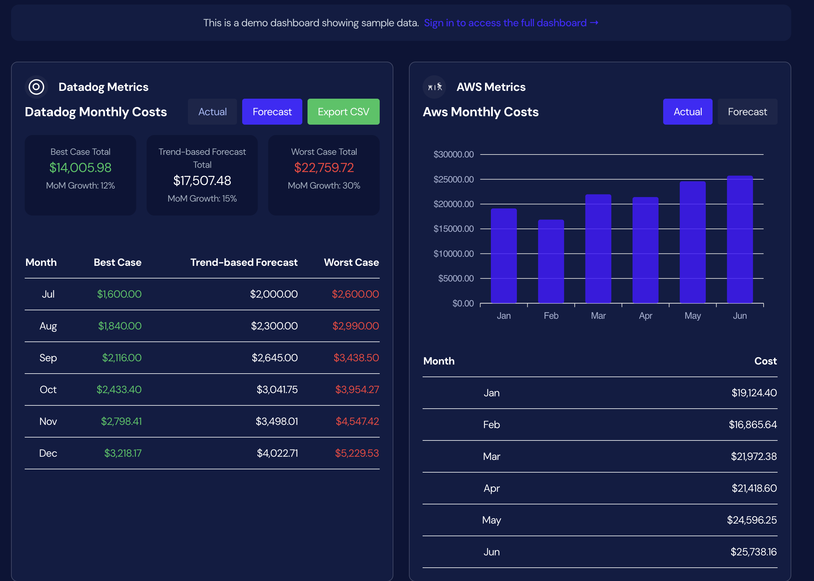

# FinDash - Open Source FinOps Dashboard

FinDash is an open-source FinOps dashboard designed to help organizations monitor, analyze, and optimize their cloud spending across multiple vendors.



## Features

- 📊 **Budget Tracking**: Monitor your cloud spending across multiple vendors
- 📈 **Cost Forecasting**: Predict future cloud costs using common forecasting techniques
- 🤖 **AI-Powered Insights** (Coming Soon): AI-driven forecasts and optimization suggestions

## Supported Integrations

- ✅ **Datadog**: Full support for cost metrics and forecasting
- 🔜 **AWS**: Coming soon

## Getting Started

### Prerequisites

- Node.js (v14 or higher)
- npm or yarn
- Python 3.8+
- uv (Python package installer)

### Installation

1. Clone the repository:
```bash
git clone https://github.com/yourusername/findash.git
cd findash
```

2. Install frontend dependencies:
```bash
cd dashboard
npm install
```

3. Install backend dependencies:
```bash
cd api
# Install uv if you haven't already
curl -LsSf https://astral.sh/uv/install.sh | sh

# Create a new virtual environment and install dependencies
uv venv
source .venv/bin/activate  # On Windows: .venv\Scripts\activate
uv pip install -r requirements.txt
```

4. Set up environment variables:
```bash
# In /api/.env
DATADOG_API_KEY=your_datadog_api_key
DATADOG_APP_KEY=your_datadog_app_key

# In /dashboard/.env
REACT_APP_BACKEND_URL=http://localhost:8000
```

5. Start the development servers:
```bash
# Start backend (from /api directory)
uvicorn app.main:app --reload

# Start frontend (from /dashboard directory)
npm start
```

## Contributing

We welcome contributions! Please see our [Contributing Guide](CONTRIBUTING.md) for details on how to:
- Set up your development environment
- Submit pull requests
- Report issues
- Propose new features

## Architecture

FinDash consists of two main components:

1. **Frontend** (`/dashboard`):
   - React with TypeScript
   - TailwindCSS for styling
   - Auth0 for authentication
   - ApexCharts for data visualization

2. **Backend** (`/api`):
   - FastAPI (Python)
   - Integration with cloud vendor APIs
   - Cost analysis and forecasting algorithms
   - uv for dependency management

## License

This project is licensed under the MIT License - see the [LICENSE](LICENSE) file for details.

## Support

If you need help or have questions:
- Open an issue
- Join our community discussions
- Check out our documentation

## Roadmap

- [x] Datadog Integration
- [ ] AWS Integration
- [ ] GCP Integration
- [ ] Azure Integration
- [ ] AI-powered cost optimization suggestions
- [ ] Custom alerting rules
- [ ] Budget management
- [ ] Team collaboration features

## Acknowledgments

- Thanks to all our contributors
- Built with [React](https://reactjs.org/) and [FastAPI](https://fastapi.tiangolo.com/)
- Powered by [Auth0](https://auth0.com/) for authentication
